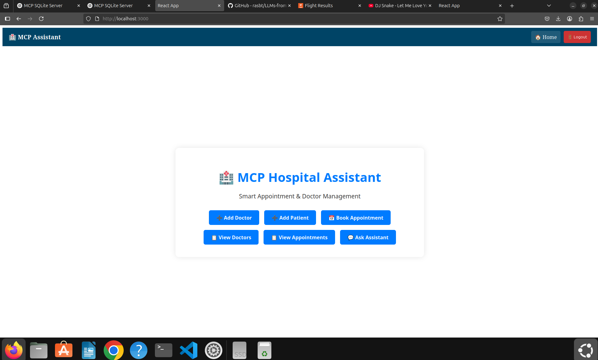
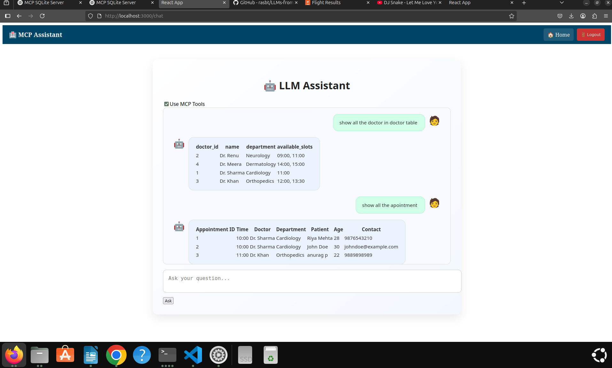
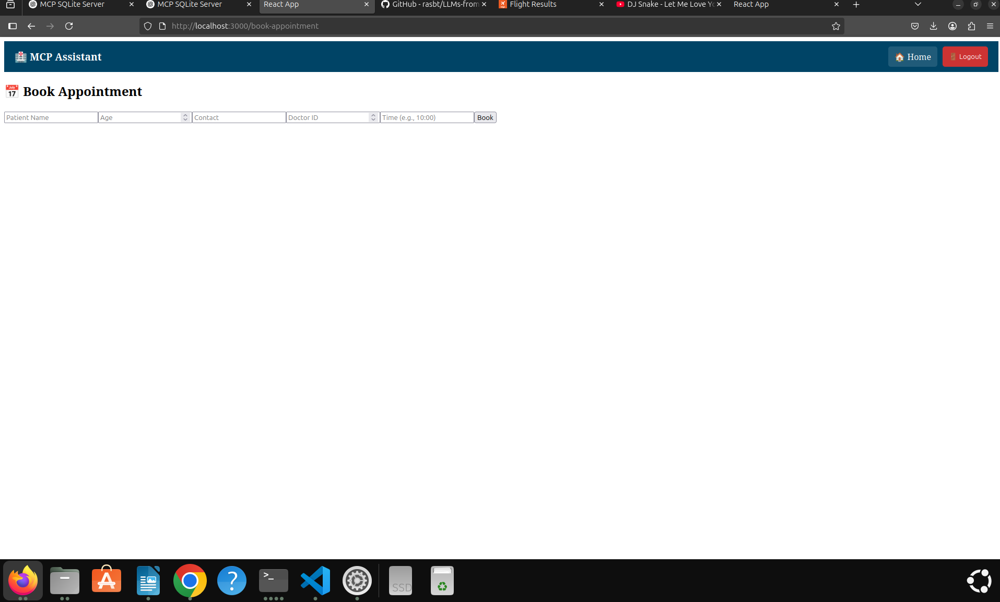

# 🏥 MCP Hospital Assistant

A full-stack intelligent hospital appointment management system powered by React, Node.js, PostgreSQL, and Mistral LLM (via Ollama).
## 🔥 Preview

### 🎥 Demo Video

[▶️ Click here to watch the demo](./MCP_DEMO.webm)

### 🏠 Dashboard  

### 💬 LLM Chat Assistant  

### 💬 Mannual Booking  

    🔁 Node.js + Express

    🎨 React.js (frontend)

    🧠 LLM (Ollama - Mistral)

    💾 PostgreSQL

    🛡️ Session-based login

📷 UI Preview

    Login / Register Page

    Dashboard with buttons to manage system manually

    Book Appointment (manual)

    LLM-powered auto assistant interface

📁 Project Structure

├── backend/
│   ├── server.js              # Node.js + Express backend
│   ├── config/config.js       # PostgreSQL config
│   ├── mcp/                   # All business logic handlers
│   ├── auth/                  # Login, register, session routes
├── frontend/
│   └── mcp-ui/                # React frontend
│       ├── components/        # AddDoctor, Chat, Login, Home etc.
│       └── App.js             # Main route controller

⚙️ Setup Instructions
1. ✅ Install PostgreSQL and create DB

sudo apt install postgresql postgresql-contrib
sudo -u postgres psql

Then run:

CREATE DATABASE mcp;
CREATE USER mcpuser WITH PASSWORD 'mcppass';
GRANT ALL PRIVILEGES ON DATABASE mcp TO mcpuser;

2. 📦 Create Schema

Connect:

psql -U mcpuser -d mcp -h localhost

CREATE TABLE doctors (
  doctor_id SERIAL PRIMARY KEY,
  name TEXT,
  department TEXT,
  available_slots JSONB
);

CREATE TABLE patients (
  patient_id SERIAL PRIMARY KEY,
  name TEXT,
  age INTEGER,
  contact TEXT
);

CREATE TABLE appointments (
  appointment_id SERIAL PRIMARY KEY,
  doctor_id INTEGER REFERENCES doctors(doctor_id),
  patient_id INTEGER REFERENCES patients(patient_id),
  appointment_time TEXT
);

CREATE TABLE users (
  id SERIAL PRIMARY KEY,
  username TEXT UNIQUE,
  password TEXT
);

GRANT ALL PRIVILEGES ON ALL TABLES IN SCHEMA public TO mcpuser;
GRANT ALL PRIVILEGES ON ALL SEQUENCES IN SCHEMA public TO mcpuser;

3. 🧠 Install Ollama with Mistral

curl -fsSL https://ollama.com/install.sh | sh
ollama run mistral

Make sure the local Ollama server is running and available on default port 11434.
4. 🚀 Backend Setup (Node.js)

cd backend/
npm install
node server.js

This starts backend on: http://localhost:3007
5. 💻 Frontend Setup (React)

cd frontend/mcp-ui
npm install
npm start

This starts frontend at: http://localhost:3000
🧠 Key Functionalities
✨ Mode 1: Manual via UI

You can click on homepage icons to:

    ➕ Add Doctor

    ➕ Add Patient

    📅 Book Appointment

    📋 View Doctors

    📋 View Appointments

These UI features directly use API endpoints (/api/execute, /api/book, etc.)
🔍 Mode 2: Smart Assistant (LLM-enabled)

From the "Ask Assistant" chat interface:

    Type: Show all appointments

    Or: Book appointment for patient John with doctor 2 at 10:00

✅ If MCP Tools is enabled (checkbox at top), the LLM will:

    🔎 Understand user command

    🔧 Choose correct tool from tools.json

    🧠 Generate SQL

    🔁 Automatically execute API calls behind the scenes

❌ If disabled, LLM simply gives plain answers (no system change).
🔐 Authentication

    Only authenticated users can access core pages.

    Register page stores hashed credentials securely in PostgreSQL.

    Session stored using express-session.

📝 Example Prompts for LLM

Show all the doctors in doctor table
Show appointments after 11:00
Book an appointment with Dr. Renu at 09:00 for John (age 30)

✅ Summary
Feature	Manual UI	LLM Tools
Add Doctor	✅ Yes	✅ via prompt
Book Appointment	✅ Yes	✅ if slot available
View Doctors/Appointments	✅ Yes	✅ via prompt
Edit Slots	✅ Yes (via query)	✅ via prompt
Security	🔐 Session Login	🔐 Session Protected